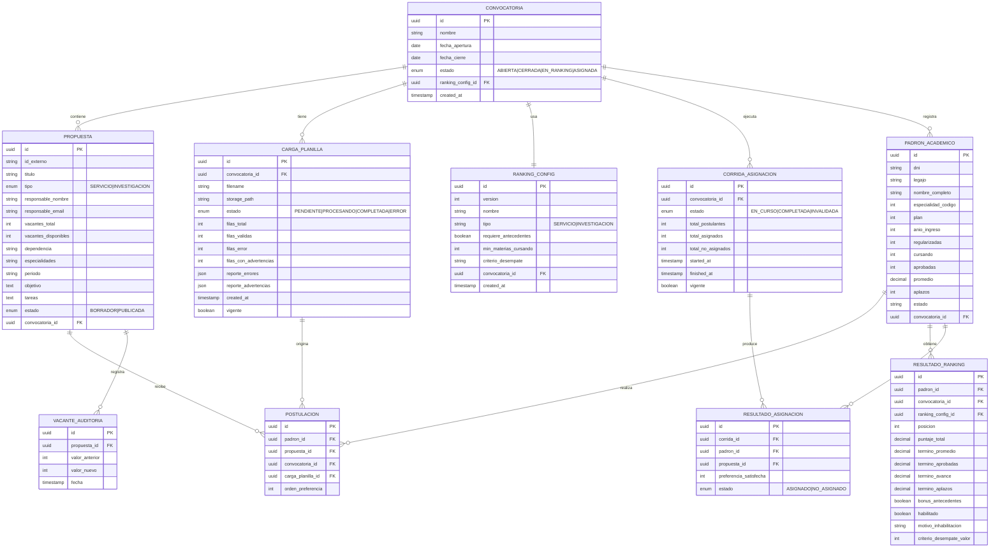

# Plan de Implementación — Backend Plataforma de Becas

> [!IMPORTANT]
> Este plan cubre **exclusivamente el backend** (NestJS + Node.js).
> Se basa en el ERS-PDB-001 v1.1 y en los archivos Excel reales encontrados en `/csv`.
> **Sin autenticación ni roles:** el sistema es de uso interno cerrado. Los profesores/responsables no son usuarios del sistema; figuran únicamente como datos en los archivos Excel.

---

## 1. Stack Tecnológico

| Capa | Tecnología | Justificación |
|---|---|---|
| Runtime | Node.js 20 LTS | Requerimiento ERS §2.4 |
| Framework | NestJS 10 | Requerimiento ERS §2.4 |
| ORM | Prisma 5 | Type-safety, migraciones, streaming con cursores (RNF-02) |
| Base de datos | PostgreSQL 16 | Soporte `SELECT ... FOR UPDATE` para atomicidad de vacantes (RNF-03) |
| Cola de tareas | BullMQ + Redis | Jobs asíncronos para importación y asignación (RF-09, RNF-04) |
| Lectura Excel | `exceljs` (streaming) | Parseo fila-a-fila sin cargar en memoria (RNF-02) |
| Eventos de dominio | `@nestjs/event-emitter` | Patrón Observer para auditoría y notificaciones (§4.4) |
| Validación | `class-validator` + `class-transformer` | Pipes de NestJS |
| Testing | Jest + Supertest | Unitario e integración |
| Documentación API | `@nestjs/swagger` | OpenAPI auto-generado |
| Contenedor | Docker + Docker Compose | Dev parity, despliegue |

---

## 2. Datos Reales de los Archivos Excel

> [!NOTE]
> Los archivos en `/csv` revelan el esquema de datos **real** ya en uso. El backend debe ser compatible.

### `inscripciones (3).xlsx` — Planilla de Postulaciones
317 filas × 18 columnas. Columnas reales:

| Columna Excel | Campo interno | Tipo | Notas |
|---|---|---|---|
| DNI | `dni` | string | Clave de cruce con `maestro.xlsx` |
| Apellido | `apellido` | string | Se verifica contra maestro |
| Nombre | `nombre` | string | Se verifica contra maestro |
| Legajo | `legajo` | string | Se verifica contra maestro |
| Carrera | `carrera` | string | Código: ISI, IQ, IEM, etc. |
| Email | `email` | string | |
| Promedio | `promedio` | decimal | **Se verifica contra maestro** — error si difiere |
| Aprobadas | `aprobadas` | int | **Se verifica contra maestro** — error si difiere |
| Cursadas | `cursadas` | int | **Se verifica contra maestro** |
| Materias de la carrera | `materias_carrera` | int | Referencia del plan |
| Numero de Aplazos | `aplazos` | int | **Se verifica contra maestro** |
| Factor | `factor` | decimal | Ignorado en importación — el sistema recalcula el puntaje (RN-04) |
| Prioridad 1..5 | `preferencia_1`..`preferencia_5` | string | Formato: `{id_propuesta} - prio: {N}` |

### `maestro.xlsx` — Padrón Académico Institucional (fuente de verificación)
26.943 filas × 16 columnas. **El header real está en la fila 6** (filas 1–5 son metadatos institucionales).

| Col. Excel | Campo interno | Tipo | Rol en verificación |
|---|---|---|---|
| Esp. | `especialidad_codigo` | int | |
| Plan | `plan` | int | |
| Legajo | `legajo` | string | Clave de cruce alternativa |
| Ingr. | `anio_ingreso` | int | Fuente de antigüedad |
| N°Documento | `dni` | string | **Clave primaria de cruce** |
| Apellido y Nombres | `nombre_completo` | string | Verificación de identidad |
| Regularizadas | `regularizadas` | int | Verificación |
| Cursando año actual | `cursando` | int | Verificación |
| Total Aprobadas | `aprobadas` | int | **Verificación — fuente de verdad** |
| Prom.c/Apl | `promedio` | decimal | **Verificación — fuente de verdad** |
| Estado | `estado` | string | Activo/Graduado — sólo Activos pueden postularse |
| Cant. (col 16) | `cant_aplazos` | int | **Verificación — fuente de verdad** |

### `Solicitud-2026-08-20.xls` — Propuestas de Becas
88 filas × 19 columnas:

| Columna Excel | Campo interno | Tipo | Notas |
|---|---|---|---|
| numero | `id_externo` | string | ID único de propuesta — referenciado en `Prioridad N` de inscripciones |
| responsable_ayn | `responsable_nombre` | string | |
| responsable_email | `responsable_email` | string | |
| tipo | `tipo` | enum | `S` = Servicio, `I` = Investigación |
| area_servicio / area_investigacion | `area` | string | Según tipo |
| proyecto | `titulo` | string | |
| cantidad_becarios | `vacantes_total` | int | Cupo total |
| cantidad_modulos | `modulos` | int | |
| regularizadas / aprobadas / otros | `req_*` | string | Requisitos textuales |
| especialidad | `especialidades` | string | Códigos separados por coma: `42,34,5,...` |
| periodo | `periodo` | string | Ej: `AN` = Anual |
| horario / objetivo / tareas / observaciones | — | text | |
| dependencia__nombre | `dependencia` | string | Área/secretaría |

---

## 3. Lógica de Verificación contra el Maestro

> [!IMPORTANT]
> Esta es la lógica central de la Fase 3. El `maestro.xlsx` se carga **una sola vez por convocatoria** como padrón de referencia. Durante la importación de la planilla de inscripciones, **cada fila se cruza contra ese padrón**.

### Flujo de verificación por fila

```
Fila de inscripcion (DNI, promedio, aprobadas, aplazos, ...)
         │
         ▼
  Buscar DNI en tabla PADRON_ACADEMICO
         │
    ┌────┴────┐
   NO       SÍ
    │         │
    ▼         ▼
 ERROR    Comparar campos
 "DNI no   académicos
  en padrón"
         │
    ┌────┴────────────────────────┐
    │  Campo     │  Tolerancia    │
    │  promedio  │  ±0.05         │
    │  aprobadas │  exacto        │
    │  aplazos   │  exacto        │
    │  legajo    │  exacto        │
    └────────────┴────────────────┘
         │
    ¿Discrepancia?
    ┌────┴────┐
   SÍ        NO
    │          │
    ▼          ▼
 ADVERTENCIA  Usar datos del PADRON
 en reporte   para el ranking
 (fila igual  (ignorar valores
  procesada   de la planilla)
  con datos
  del padrón)
```

### Reglas de cruce

| Condición | Comportamiento | Severidad |
|---|---|---|
| DNI no existe en el padrón | Fila rechazada — no genera postulación | Error (bloquea) |
| Estado en padrón ≠ "Activo" | Advertencia al operador — **requiere confirmación explícita** para descartar o incluir la fila | Warning + confirmación |
| Legajo de la planilla ≠ padrón | Advertencia en reporte; se usa el del padrón | Warning |
| Promedio de la planilla ≠ padrón (coincidencia exacta) | Advertencia; se usa el valor del padrón | Warning |
| Aprobadas difiere | Advertencia; se usa el valor del padrón | Warning |
| Aplazos difiere | Advertencia; se usa el valor del padrón | Warning |
| ID de propuesta en preferencia no existe | Fila rechazada — preferencia inválida | Error (bloquea) |
| Estudiante con > 5 preferencias | Filas excedentes rechazadas (se conservan las 5 primeras por orden de preferencia declarado) | Error parcial |
| Orden de preferencia duplicado para el mismo estudiante | Fila rechazada | Error (bloquea) |

### Datos usados para el ranking

Los datos académicos que alimentan la fórmula de ranking **siempre provienen del padrón** (`PADRON_ACADEMICO`), no de la planilla. La planilla sólo provee:
- Identidad del estudiante (DNI como clave de cruce)
- Preferencias de propuestas (1 a 5)

---

## 4. Arquitectura de Módulos NestJS

```
src/
├── convocatorias/               # Ciclo de vida de la convocatoria
├── propuestas/                  # CRUD de propuestas y vacantes
├── padron/                      # Carga y consulta del maestro.xlsx
│   ├── padron.service.ts        # Lookup por DNI/legajo
│   └── padron-import.processor.ts  # BullMQ worker para carga inicial
├── importacion/                 # Carga y validación de planillas
│   ├── importacion.processor.ts # BullMQ worker principal
│   ├── planilla-parser.ts       # Streaming exceljs + regex prioridades
│   └── planilla-verifier.ts     # Lógica de cruce contra padrón
├── ranking/
│   ├── strategies/
│   │   ├── ranking.strategy.ts          # Interfaz Strategy
│   │   ├── ranking-v1.strategy.ts       # Fórmula ponderada actual
│   │   └── ranking-investigacion.strategy.ts
│   ├── ranking-context.service.ts
│   └── ranking.processor.ts     # BullMQ worker
├── asignacion/
│   ├── asignacion-engine.service.ts
│   ├── asignacion.processor.ts
│   └── listeners/
│       ├── auditoria.listener.ts
│       └── notificacion.listener.ts
├── convocatoria-facade/         # Patrón Facade — orquestación del cierre
├── reportes/
├── auditoria/
└── common/
```

---

## 5. Esquema de Base de Datos



> [!NOTE]
> No existe tabla de usuarios ni sesiones. El padrón académico vive en `PADRON_ACADEMICO`, cargado del `maestro.xlsx` y scopeado por convocatoria. Los campos de auditoría que antes referenciaban un usuario fueron eliminados.

---

## 6. Fases de Implementación

### Fase 1 — Fundación (Semana 1–2)
**Objetivo:** proyecto corriendo con estructura base y Docker. Sin capa de autenticación.

| Tarea | RF/RNF | Prioridad |
|---|---|---|
| Inicializar proyecto NestJS con Prisma + PostgreSQL | — | Alta |
| Docker Compose (app + postgres + redis) | RNF-06 | Alta |
| Módulo `convocatorias`: CRUD + estados (ABIERTA→CERRADA→EN_RANKING→ASIGNADA) | RF-11 | Alta |
| Swagger auto-generado (`@nestjs/swagger`) | RNF-11 | Alta |

**Entregables:** API abierta con convocatorias funcionando y Swagger.

---

### Fase 2 — Propuestas y Carga del Padrón (Semana 3–4)
**Objetivo:** propuestas gestionables y padrón académico disponible para verificación.

| Tarea | RF/RNF | Prioridad |
|---|---|---|
| Módulo `propuestas`: CRUD, estados (BORRADOR/PUBLICADA), cupos | RF-01, RF-02, RF-03 | Alta |
| Auditoría de cambios en vacantes (`VACANTE_AUDITORIA`) | RF-04 | Media |
| Importación masiva de propuestas desde el XLS de solicitudes | — | Alta |
| Módulo `padron`: job BullMQ `PadronImportProcessor` para cargar `maestro.xlsx` streaming | RNF-02 | Alta |
| Saltear filas 1–5 del maestro.xlsx (metadatos); header en fila 6 | — | Alta |
| `PadronService.findByDni(dni, convocatoriaId)` — lookup O(1) con índice en BD | — | Alta |
| Endpoint para descargar plantilla estándar de inscripciones (.xlsx) | RF-05 | Alta |

**Entregables:** padrón de ~26k estudiantes cargado e indexado; propuestas importadas.

---

### Fase 3 — Importación y Verificación de Planilla de Inscripciones (Semana 5–7)
**Objetivo:** carga asíncrona con validación fila-por-fila y cruce contra el padrón.

| Tarea | RF/RNF | Prioridad |
|---|---|---|
| Endpoint `POST /convocatorias/:id/planillas` (multipart/form-data) | RF-06 | Alta |
| Job `ImportacionPlanillaProcessor` — parseo streaming con `exceljs` | RF-09, RNF-02 | Alta |
| `PlanillaParser`: regex `/^(.+)\s*-\s*prio:\s*(\d)$/` para columnas Prioridad 1..5 | — | Alta |
| `PlanillaVerifier.verificarFila(fila, padronEntry)`: implementar todas las reglas de cruce | RF-07, RN-11 | Alta |
| Generar `reporte_errores` (filas bloqueantes) y `reporte_advertencias` (filas procesadas con corrección) | RF-07 | Alta |
| Persistir postulaciones sólo con datos provenientes del padrón (no de la planilla) | — | Alta |
| Lógica de reemplazo de planilla vigente (invalidar versión anterior) | RF-08 | Media |
| Bloqueo de carga post-cierre convocatoria (HTTP 409) | RF-10, RN-02 | Alta |
| Endpoint `GET /convocatorias/:id/planillas/:jobId/status` — progreso y resultado | RF-09 | Alta |

**Entregables:** importación funcional; cada postulación tiene datos académicos verificados del padrón.

---

### Fase 4 — Ranking con Patrón Strategy (Semana 8–9)
**Objetivo:** implementación de la fórmula de mérito confirmada con desglose auditable.

| Tarea | RF/RNF | Prioridad |
|---|---|---|
| Interfaz `RankingStrategy` con `calcularPuntaje(padron: PadronAcademico): PuntajeDesglose` | RNF-07 | Alta |
| `RankingV1Strategy`: implementa la fórmula oficial (ver abajo) | RF-12 | Alta |
| `RankingContextService` + Factory Provider NestJS (`useFactory`) | RF-14, RN-10, RNF-07 | Alta |
| Endpoint `PUT /convocatorias/:id/ranking-config` — configurar parámetros hab. y desempate | RF-14 | Alta |
| Validación de condiciones habilitantes antes de calcular puntaje | RN-03 | Alta |
| Job `RankingProcessor` — cursores Prisma sobre `POSTULACION`, sin carga total en memoria | RNF-01, RNF-02 | Alta |
| Resolución de empates por criterio configurado (`criterio_desempate`) | RF-13, RN-05 | Alta |
| Endpoints de consulta: ranking paginado + desglose individual por término | RF-13, RF-15 | Alta/Media |

**Fórmula oficial de ranking (provista por el equipo funcional):**

```
Factor = promedio
       + (aprobadas × 0.1)
       + ((cursadas × 3) / total_materias_plan)
       + (2 / (1 + aplazos))
       -- término "antecedentes" PENDIENTE: ver nota abajo
```

Desglose por término (trazabilidad por estudiante):

| Término | Variable fuente | Descripción |
|---|---|---|
| `promedio` | `PADRON_ACADEMICO.promedio` | Promedio académico (escala 0–10) |
| `aprobadas × 0.1` | `PADRON_ACADEMICO.aprobadas` | Premia cantidad de materias aprobadas |
| `(cursadas × 3) / total_materias` | `PADRON_ACADEMICO.cursando` + `total_materias_plan` | Avance relativo ponderado |
| `2 / (1 + aplazos)` | `PADRON_ACADEMICO.aplazos` | Penalización no lineal: 2 si aplazos=0, 1 si aplazos=1, 0.67 si aplazos=2... |
| ~~`antecedentes`~~ | **PENDIENTE** | +0.5 si tiene antecedentes de beca previa — ignorado hasta confirmar fuente del dato |

**Condiciones habilitantes** (excluyen al estudiante del ranking si no se cumplen — quedan como `habilitado = false`):
- El estudiante está cursando al menos **3 materias** en el período (`cursando ≥ 3`)
- El estudiante tiene al menos **1 materia regular** (`regularizadas ≥ 1`)

> [!NOTE]
> La fórmula es fija — no hay pesos configurables. El patrón Strategy sigue siendo válido para encapsular eventuales variantes futuras (ej: fórmula diferente para becas de investigación). El único parámetro configurable por convocatoria es el criterio de desempate y los umbrales habilitantes.

> [!CAUTION]
> El término `antecedentes` (+0.5) está **excluido de la implementación actual** hasta confirmar su fuente de datos. La arquitectura de `RankingV1Strategy` debe prever su incorporación futura sin cambiar la interfaz.

**Entregables:** ranking calculado con desglose término a término, condiciones habilitantes aplicadas.

---

### Fase 5 — Motor de Asignación, Reportes y Auditoría (Semana 10–11)
**Objetivo:** asignación automática atómica + exportaciones.

| Tarea | RF/RNF | Prioridad |
|---|---|---|
| `AsignacionEngineService`: iteración en orden de ranking, evaluación preferencias 1→5 | RF-16, RF-17, RN-06 | Alta |
| Decremento atómico de vacantes con `$transaction` + `SELECT ... FOR UPDATE` | RF-18, RNF-03 | Alta |
| Registro de `RESULTADO_ASIGNACION` (ASIGNADO / NO_ASIGNADO) | RF-19, RN-09 | Alta |
| Job `AsignacionProcessor` desacoplado del ciclo HTTP | RNF-04 | Alta |
| Eventos Observer: `EstudianteAsignado`, `EstudianteNoAsignado`, `AsignacionFinalizada` | RF-21 | Baja |
| `AuditoriaListener`: persiste cada evento de forma inmutable | RNF-08 | Alta |
| `NotificacionListener`: stub para fase futura | RF-21 | Baja |
| `ConvocatoriaFacadeService.cerrarYAsignar(convocatoriaId)` | §4.5 ERS | Alta |
| Re-ejecución controlada: invalidar corrida anterior + nueva `CORRIDA_ASIGNACION` | RF-22, RN-08 | Media |
| `ReporteService`: exportar resultado a .xlsx con `exceljs` | RF-20 | Media |
| Tests de concurrencia: N requests simultáneos → max V asignaciones | RNF-03 | Alta |
| Tests de performance: ranking 10.000 postulantes < 30s | RNF-01 | Alta |

**Entregables:** motor de asignación funcional, auditable y exportable.

---

## 7. Contratos de API (resumen)

> [!NOTE]
> Sin autenticación: todos los endpoints son abiertos. El control de acceso queda en la capa de red/infraestructura (acceso por red interna o VPN, según decisión operativa).

| Método | Endpoint | RF |
|---|---|---|
| GET | `/convocatorias` | — |
| POST | `/convocatorias` | RF-11 |
| PUT | `/convocatorias/:id/ranking-config` | RF-14 |
| POST | `/convocatorias/:id/padron` | — |
| GET | `/convocatorias/:id/padron/:jobId/status` | — |
| POST | `/convocatorias/:id/cierre` | RF-11 |
| GET | `/propuestas` | RF-02 |
| POST | `/propuestas` | RF-01 |
| PUT | `/propuestas/:id` | RF-03 |
| GET | `/propuestas/template` | RF-05 |
| POST | `/convocatorias/:id/planillas` | RF-06 |
| GET | `/convocatorias/:id/planillas/:jobId/status` | RF-09 |
| GET | `/convocatorias/:id/ranking` | RF-13 |
| GET | `/convocatorias/:id/ranking/estudiante/:dniOLegajo` | RF-15 |
| GET | `/convocatorias/:id/asignacion/status` | RF-22 |
| GET | `/convocatorias/:id/reportes/asignacion` | RF-20 |
| GET | `/convocatorias/:id/resultado/:dni` | RF-19 |

---

## 8. Decisiones de Arquitectura

| # | Decisión | Alternativa descartada | Razón |
|---|---|---|---|
| ADR-01 | Prisma + PostgreSQL | TypeORM + MySQL | Cursores nativos, `$transaction` con FOR UPDATE, type-safety |
| ADR-02 | BullMQ + Redis para todos los jobs pesados | Procesamiento síncrono | RNF-04/RNF-05: no bloquear event loop ni generar timeouts HTTP |
| ADR-03 | `exceljs` streaming | `xlsx` (SheetJS) full-load | RNF-02: límite de memoria 512 MB para archivos grandes |
| ADR-04 | `PADRON_ACADEMICO` scopeado por convocatoria | Tabla global de estudiantes | Permite que el padrón varíe entre convocatorias sin afectar resultados históricos |
| ADR-05 | Datos del padrón prevalecen sobre la planilla | Planilla como fuente de verdad | El padrón es el registro oficial institucional; la planilla puede contener errores del informante |
| ADR-06 | Coincidencia exacta de promedio (sin tolerancia) | Tolerancia ±0.05 | El promedio del padrón es el dato oficial; cualquier diferencia debe ser reportada |
| ADR-07 | Estudiantes no activos → advertencia + confirmación del operador | Rechazo automático silencioso | El operador debe decidir conscientemente; el sistema no descarta sin aviso |
| ADR-08 | Sin autenticación ni roles | JWT + guards | Sistema cerrado de uso interno; sin necesidad de control de acceso en la API |
| ADR-08 | Profesores como dato (no como usuario) | Cuenta de docente en el sistema | Los profesores sólo figuran en el Excel como `responsable_ayn` / `responsable_email` |
| ADR-09 | Strategy via Factory Provider NestJS | Switch/if en el service | RNF-07: principio abierto/cerrado |
| ADR-10 | `SELECT ... FOR UPDATE` en `$transaction` | Optimistic locking | RNF-03: garantía fuerte de atomicidad en vacantes |
| ADR-11 | Fila 6 como header en `maestro.xlsx` | Auto-detección | Formato real tiene 5 filas de metadatos institucionales |
| ADR-12 | Regex `/^(.+)\s*-\s*prio:\s*(\d)$/` para Prioridades | Columnas separadas | El formato real del Excel usa una sola celda por preferencia |

---

## 9. Ítems Resueltos y Pendientes

1. ~~**`Datos orden de mérito BIS 2026 (1).xlsx`**~~ ✅ **Resuelto** — el archivo `(2).xlsx` contiene la fórmula oficial y confirma las condiciones booleanas habilitantes.
2. ~~**Identificador de propuesta en preferencias**~~ ✅ **Resuelto** — ID de 16 dígitos confirmado como `numero` del XLS de solicitudes.
3. ~~**Tolerancia en cruce de promedio**~~ ✅ **Resuelto** — coincidencia **exacta** requerida. Cualquier diferencia genera advertencia y se usa el valor del padrón.
4. ~~**Estudiantes no activos**~~ ✅ **Resuelto** — el sistema emite una **advertencia al operador y solicita confirmación** antes de descartar la fila.
5. ~~**Control de acceso a nivel de red**~~ ✅ **Resuelto** — no se requiere ningún control de acceso.

> [!CAUTION]
> **Único ítem abierto:** el término `antecedentes` (+0.5 en la fórmula de ranking) está **pendiente de implementación**. Confirmar: ¿es una columna de la planilla de inscripciones, un campo del padrón maestro, o requiere una carga separada? La `RankingV1Strategy` debe dejar el campo ignorado (`antecedentes = 0`) hasta resolver este punto.
